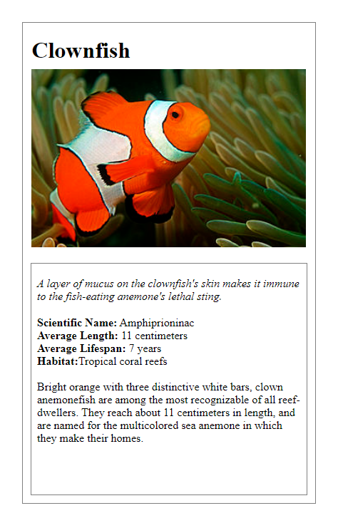

#Animal Card

# About The Project
This is about creating a card describing an animal named clownfish, 
this template canalso beadopted to create a website giving description to anything at all

## Built With
* CSS
* HTML

## Author
* 👨‍🦱Ezekiel Ogunniwa
  * Github: https://github.com/Eminentzeal
  * linkedin: https://www.linkedin.com/in/ogunniwaezekiel/
  * Twitter: https://twitter.com/Ogunniwaezekiel
* 👩Esther Davies
  * Github: https://github.com/Esther94
  * Twitter: @Esther62849599

## Facilitators
* [Godwin Nwachukwu](https://github.com/Gnwin).

* [Chioma Nwachukwu](https://github.com/Chiomy).
* [Tim Chosen](www.twitter.com/timchosen)

## Acknowledgements
* [HomeFrontStartup](http://homefrontstartup.com.ng/
* [Mentors International](https://mentorsint.com/)
  * https://www.facebook.com/mentorshubyola/
  * https://twitter.com/hub_mic
  * https://www.linkedin.com/company/michub/

## Live Demo
[Click Here to see project live](https://ezekiel-esther-animal-card.netlify.app/)

## 🤝 Contributions
* This project is open to your comments and contributions, kindly reach the author through the above author's social media handles.
